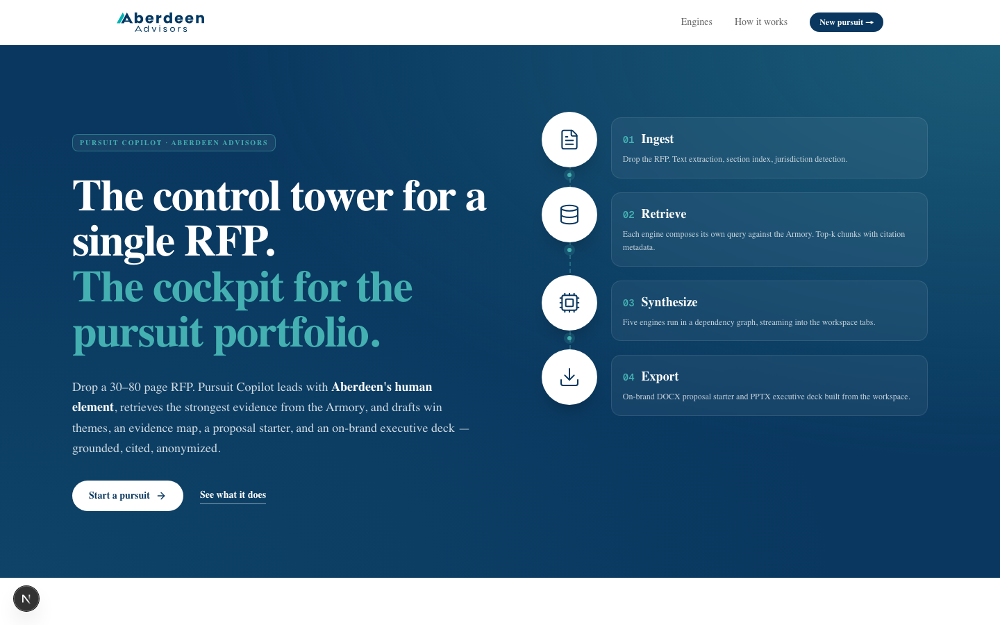
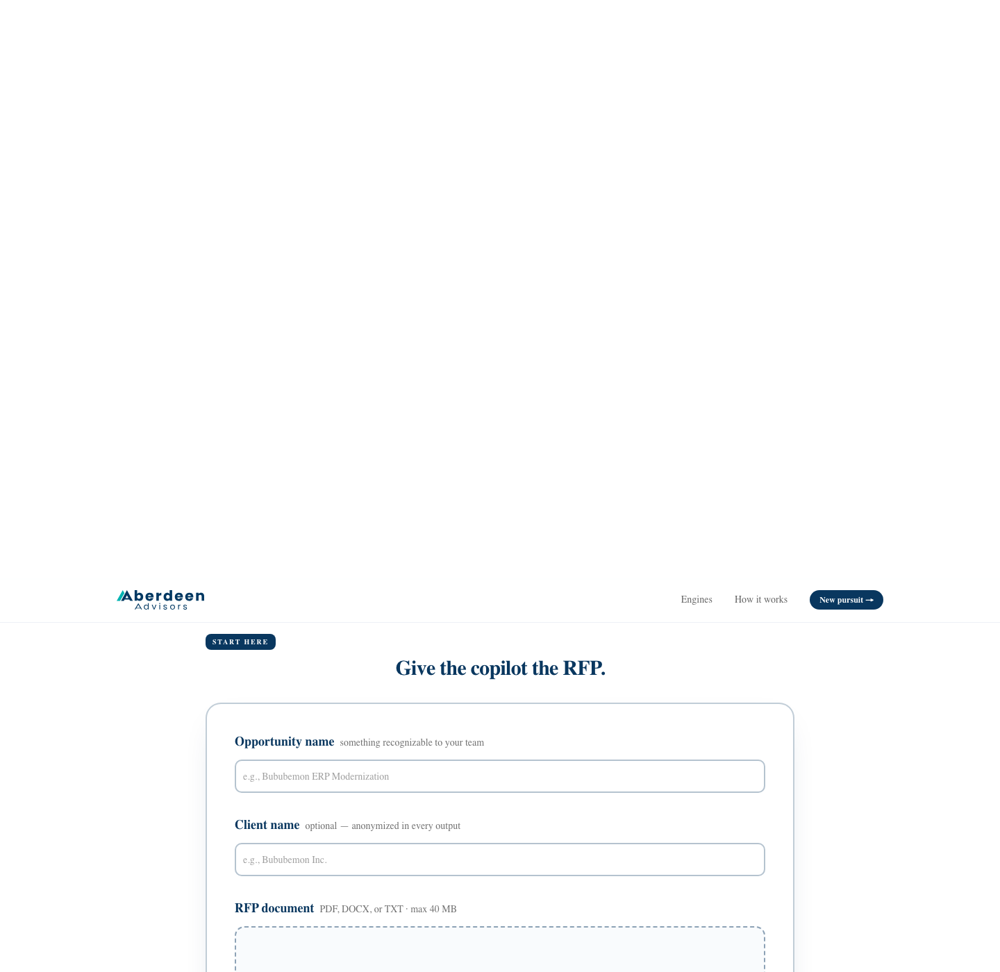

<p align="center">
  
</p>

<h1 align="center">Pursuit Copilot</h1>

<p align="center">
  <strong>The control tower for a single RFP.</strong><br/>
  <em>The cockpit for the pursuit portfolio.</em>
</p>

<p align="center">
  
</p>

---

## Why we built this

Consulting firms typically receive attractive RFPs on tight timelines — often seven days from release to submission. In that window, a pursuit team has to:

- Read a 30–80 page RFP end to end
- Extract every requirement, evaluation criterion, and formatting rule
- Search past proposals, case studies, and credentials for the strongest evidence
- Position Aberdeen against competitors who will submit similar generic capabilities
- Draft the executive summary, approach, team, and timeline
- Format everything to the RFP's rules — federal, state, or commercial

Doing this manually consumes hours or days **before the team even starts producing the proposal**. Competitors are all working from the same starting point. The result is late nights, generic responses, and pursuits that lose on differentiation rather than merit.

**Pursuit Copilot turns that first week into a first hour.** Drop the RFP, click one button, and you get a pursuit brief and proposal starter grounded in Aberdeen's own Culture Charter, case studies, and prior proposals — with the human element leading every claim.

---

## What it does, in one hour

You upload an RFP. The copilot runs five engines in sequence, streaming results into a live workspace.

| Engine | Question it answers | What you get |
| --- | --- | --- |
| **01 · Understand** | What does this client actually need? | Opportunity Brief · Requirements Matrix with Response Actions · Compliance notes · Timeline · Questions to send back during Q&A |
| **02 · Strategize** | How do we win? | Aberdeen's Point of View · 3–4 Win Themes (each with a Human angle *and* a Technical angle) · Differentiators |
| **03 · Match** | What proves our claims? | Ranked evidence from the Armory · Requirements addressed · Gaps flagged honestly |
| **04 · Design** | What should we propose? | Solution Blueprint · Workstreams · Staffing Model · Post-award Delivery Timeline |
| **05 · Create** | How do we communicate it? | Proposal outline · First-draft prose for Executive Summary / Our Understanding / Proposed Approach · Why Aberdeen · Executive deck spec |

Every output is:

- **Grounded** — every claim about Aberdeen is backed by real content from the Armory (case studies, culture charter, services, prior proposals). No fabrication. If the Armory doesn't support a claim, the copilot says "Not evidenced" and drops it.
- **Cited** — behind every Aberdeen fact is a source document you can open.
- **Anonymized** — real client names in the Armory become descriptors like "a $1B revenue healthcare firm" in every displayed and exported output.

---

## The human element — first

Aberdeen's strongest differentiator is not our technical capabilities. It's how we work. The copilot enforces this: **the human element leads every win theme, every point of view, every Why-Aberdeen passage.** Technical differentiators support the story — they never open it.

The Culture Charter, the referral-based workforce, the Inc 5000 recognition, the low-ego / high-ownership operating posture — these appear at the top of every draft.

---

## How to use it

### 1. Drop the RFP

<p align="center">
  
</p>

Give the pursuit a short name (something recognizable to your team), optionally give the client's real name (it will be anonymized in every output), and drop the RFP file. PDF, DOCX, or TXT — up to 40 MB. Click **Analyze Opportunity**.

### 2. Watch the workspace fill

Five tabs light up in sequence — Understand, Strategize, Match, Design, Create. Total analysis time is typically 2–6 minutes depending on RFP length.

**Understand tab — requirements matrix with Response Actions.** Every requirement in the RFP is bucketed by category, mandatory-vs-optional, and — most importantly — the **Response Action** the pursuit team needs to take: *Address* (explain how we'd meet it), *Provide Information*, *Provide Attachment*, *Acknowledge/Confirm*, or *Deliverable if Awarded*. Definitions are inline as a legend.

**Understand tab — timeline.** Key dates and intermediate milestones plotted along a single horizontal bar so the team can see the pursuit window at a glance.

**Strategize tab — win themes.** Each theme has a **Human** angle followed by a **Technical** angle. Bullets lead with a bolded phrase and a short explanation — not paragraphs.

**Design tab — staffing model.** Roles, responsibilities, and allocation percentages sized to the engagement.

**Design tab — delivery timeline.** Post-award milestones plotted the same way as the pursuit window.

**Create tab — proposal outline and first-draft sections.** A full outline, plus written prose for the Executive Summary, Our Understanding, and Proposed Approach — ready for a partner to red-line.

### 3. Export the deliverables

Two buttons in the workspace header:

- **Export Word** — a `.docx` proposal starter in Aberdeen brand colors and Poppins. Executive Summary → Our Understanding → Proposed Approach → Relevant Experience → Team → Why Aberdeen → Requirements Matrix appendix with the Response Action column and legend.
- **Export Deck** — a `.pptx` executive deck built in Aberdeen brand colors:
  - Cover slide with the opportunity name and anonymized client descriptor
  - Section dividers with large numbered chapter marks
  - Understanding slide with 3 columns (Objectives · Pain Points · Risks) and a bottom teal chevron banner with the scope statement
  - One slide per win theme — Human column on the left, Technical column on the right, both with headline-and-body bullets
  - One slide per relevant experience match — anonymized client descriptor as the title, why-relevant paragraph, outcome callout
  - Approach slide with 3 workstream tiles
  - Human Element manifesto slide (full-bleed navy) with a pull quote from Why Aberdeen
  - Closer with "Low ego. High ownership. Let's build the response."

Both deliverables are drop-in review-ready for a partner or practice lead. They are drafts, not final proposals — the copilot's job is to save the first four days of a seven-day pursuit.

---

## What it does *not* do

- **It does not fabricate.** If the Armory doesn't have evidence for a claim about Aberdeen, the copilot writes "Not evidenced in Armory" — not a generic-sounding boast.
- **It does not expose real client names.** All Armory content is anonymized at output. The internal Armory index still knows the real names — the pursuit team can trace back — but nothing displayed or exported names a real prior client.
- **It does not replace the pursuit team.** It replaces the first 60% of the work — reading, extracting, retrieving, structuring, drafting. Partners still shape the win narrative, edit the prose, and make the calls.

---

## The Armory

The copilot's grounding comes from the **Pursuit Armory** — a folder in Aberdeen's SharePoint that holds:

- Case studies and prior engagement descriptions
- Prior RFP responses
- Aberdeen company overview and top-client credentials
- Culture Charter and value proposition materials
- Service offerings and delivery methodologies

An admin syncs the folder once (`npm run armory:sync`); the copilot indexes the content and uses it as grounded context for every engine call. The index refreshes on demand when the Armory changes.

---

## Guardrails at a glance

| Guardrail | What it means |
| --- | --- |
| **No invention** | If the Armory doesn't support a claim, the copilot says "Not evidenced" instead of guessing. |
| **Real citations** | Every claim about Aberdeen is backed by a source document. |
| **Anonymized clients** | Real client names become descriptors in every displayed and exported output. |
| **Human element first** | Culture and people always open the narrative — technology supports it. |

---

## The team

Built for the Aberdeen hackathon by **hack-team-05**:

- Carrie Stout (West Coast)
- Jordan Cook (ET)
- CJ Johnson
- Preetish Rath (also a coach)

Organizers / coaches: Liv DeSantis, Kyle Kramer.

---

## Getting it running (technical)

<details>
<summary>Click to expand: developer setup, environment variables, and deployment</summary>

### Stack

- Next.js 16 App Router · TypeScript · Tailwind 4 · shadcn/ui · Poppins
- Vercel AI Gateway routing to `anthropic/claude-opus-4-7` (orchestrator) + `anthropic/claude-sonnet-4-6` (parallel engines) + `openai/text-embedding-3-small` (embeddings)
- Upstash Vector for embedding storage
- Microsoft Graph (application-permission client-credentials) for the SharePoint Armory
- `pptxgenjs` + `docx` for exports
- Deployed on Vercel (Fluid Compute)

### 1. Environment variables

Copy `.env.example` to `.env.local` and fill in:

```
AI_GATEWAY_API_KEY=…                # Vercel AI Gateway
UPSTASH_VECTOR_REST_URL=…           # Upstash Vector index (dim 1536, cosine)
UPSTASH_VECTOR_REST_TOKEN=…
MS_GRAPH_TENANT_ID=…                # Azure AD tenant id
MS_GRAPH_CLIENT_ID=…                # Registered Azure AD app client id
MS_GRAPH_CLIENT_SECRET=…            # App secret
SHAREPOINT_SITE_ID=…                # {host},{siteCollectionId},{siteId}
SHAREPOINT_ARMORY_FOLDER_PATH=Pursuit Armory
```

For local demos without the SharePoint hookup, only `AI_GATEWAY_API_KEY` + `UPSTASH_VECTOR_REST_*` are strictly required; the Armory can be synced from a local folder instead.

### 2. Azure AD app (one-time)

Register a single-tenant app in Aberdeen's Azure tenant with application permission `Sites.Selected` (least privilege) or `Files.Read.All`. Grant admin consent. If using `Sites.Selected`, grant the app `read` on the specific SharePoint site via Graph's `PATCH /sites/{id}/permissions`.

### 3. Install + sync Armory

```
npm install
npm run armory:sync                             # SharePoint mode
# or, if Azure AD isn't wired up yet:
npm run armory:sync -- --from-dir ./tmp/armory-dump
# force a full re-embed (e.g., after metadata schema changes):
npm run armory:sync -- --from-dir ./tmp/armory-dump --force
```

### 4. Run locally

```
npm run dev
```

Open http://localhost:3000, drop an RFP, click **Analyze Opportunity**.

### 5. Deploy to Vercel

```
npm i -g vercel@latest
vercel link
vercel env pull
vercel --prod
```

Add the Upstash Vector integration to the Vercel project (Integrations → Add → Upstash Vector) to auto-provision `UPSTASH_VECTOR_REST_*` in every environment.

### Repo layout

```
app/                          # Next.js App Router pages + API routes
  api/analyze/                # RFP upload + SSE engine stream
  api/armory/{sync,search}/   # Armory ingest + debug retrieval
  api/export/{pptx,docx}/     # Downloads
  workspace/[id]/             # Live pursuit workspace
components/                   # UI (shadcn + custom tabs + tile system)
lib/
  armory/                     # SharePoint → text → chunks → embeddings → Upstash
  rfp/parse.ts                # PDF/DOCX → normalized text + section index
  engines/                    # Five engine implementations + orchestrator
  prompts/system.ts           # Aberdeen positioning + no-invention rule
  export/{pptx,docx}.ts       # On-brand exporters
  anonymize.ts                # Client-name scrub + citation-token stripping
  branding.ts                 # Palette + font + logo tokens
scripts/armory-sync.ts        # `npm run armory:sync`
assets/                       # Aberdeen brand assets (logos, slide master, style guide)
```

</details>

---

## Hackathon submission

This repo is Aberdeen Hackathon 2026 team **hack-team-05**'s submission.

**The prompt**

> A consulting firm receives an attractive RFP but has only seven days to respond, and its competitors are likely to submit similar credentials and generic approaches. The pursuit team needs to demonstrate that it understands the client's problem, not merely describe its capabilities. Build an AI-powered business development assistant designed to help teams rapidly create first drafts of proposals, pitch materials, and pursuit strategies.

**Repo landmarks**

| Path | What's inside |
| --- | --- |
| `app/`, `components/`, `lib/` | The Pursuit Copilot Next.js application described above. |
| [`reference/mock-rfps/`](reference/mock-rfps/) | Three fictional sample RFPs used as test input: Cascadia Outdoor Brands (IT/ERP modernization), Sonora Iced Tea (five-year cost and margin strategy), and Wayfarer Market Co. (growth without eroding crew culture). Each carries requirements and a weighted scoring rubric the tool answers against. |
| [`docs/`](docs/) | Build notes and output specs — Response Action definitions, proposal layout conventions, and the README screenshots. |
| [`deliverables/`](deliverables/) | Submission presentation deck. |
| `.claude/skills/aberdeen-branding/` | Reusable Aberdeen-branded exporter skills for Claude. |
